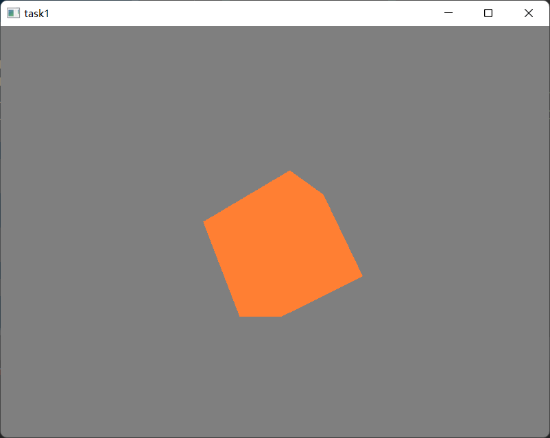

# homework1

## 作业要求

1. 使用glfw和glew或其他框架搭建OpenGL基本框架
2. 实现基本模型绘制 绘制立方体、圆球或者茶壶 
3. 实现相机控制 支持从不同视角和距离观察模型

## 完成情况

上述要求均已完成，绘制了一个旋转的橘色立方体  
使用cmake链接库的方式配置opengl（glfw+glad,同时使用glm作为矩阵向量计算库）环境  
采用核心模式完成程序编写任务

## 其他说明

**操作**：使用鼠标控制相机视角转动，键盘wasd控制相机位置，滑轮控制缩放，esc退出  
**目录结构**：debug目录下包含有可执行文件，include文件夹下为使用的头文件，lib目录下为使用的库文件，shader目录下是我使用的shader代码  
**参考**：部分代码学习自learnopengl，这是一个很棒的开源opengl教程

## 截图如下

